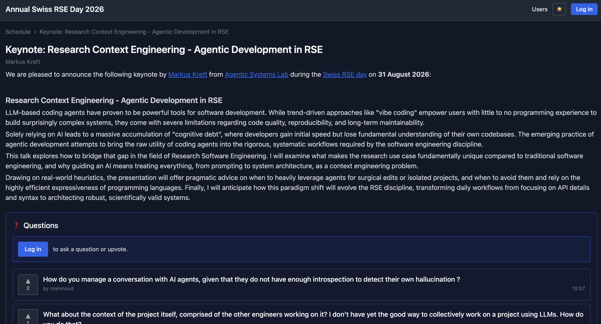
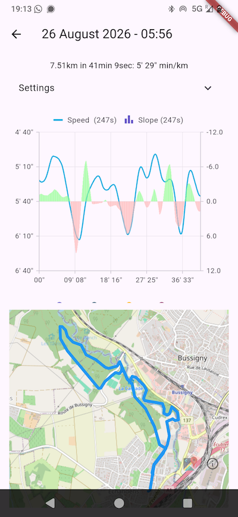
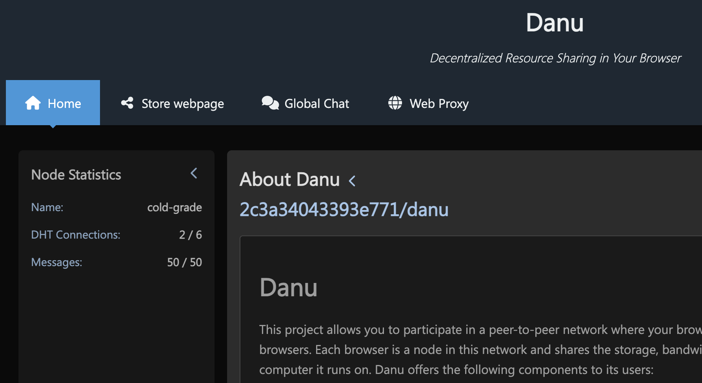
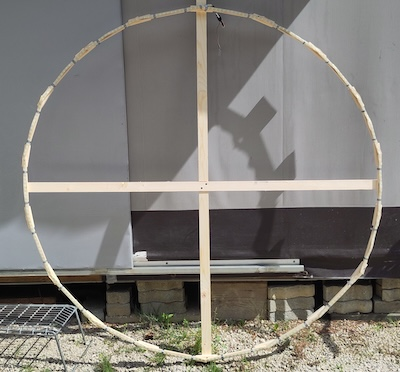
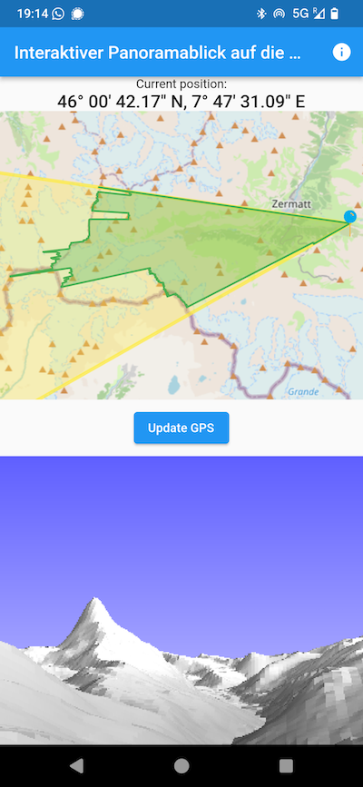

+++
date = '2026-09-04T13:37:01+02:00'
draft = false
title = 'Project Overview'
description = 'Some of my week-end projects'
showTableOfContents = false
categories = ['AI', 'Technology']
tags = ['DataHog', 'Radicle', 'Danu', 'RunLog', 'PeakTap', 'CircleLED', 'LED-Hat', 'Event-QA', 'Coop-cloud']
+++

One of the most exciting things in IT is that you can move from
ideas to an implementation very quickly.
In the era of LLMs, this time got so short that it's difficult
to follow what is worth keeping and what not.
Here is a list of my latest projects, so I can keep an eye on
the most interesting ones, and stay honest with what works and
what not.
So if you hear me say "this is one of my week-end projects",
well, here are some other ones :)

The projects are ordered by latest update.

# Coop-cloud

- Repo: https://git.coopcloud.tech/coop-cloud/nextcloud
- Type: Community support for nextcloud recipe
- TLDR: Coop-cloud offers pre-configured docker-swarm files to set
up most common services
- Last: 2026-09-02 - discussing issues

If you're running your services on a server for some self-governance
or just because you can, it is a must to check out
[Coop-cloud](https://coopcloud.tech).
It uses the `abra` tool, which handles multiple servers with multiple
[recipes](https://recipes.coopcloud.tech)
each.
While it's a bit confusing at the beginning, you can manage your
configuration in a git repo by setting `ABRA_DIR` to the root
of the repository.

Editing and testing recipes is a bit confusing, as the `abra` tool
has some assumptions with regard to the recipes which struck me
as weird.
But all in all it's a nice system which allows you to easily
handle the most common use-cases for setting up your services.
Currently I'm one of the maintainers of the `nextcloud` recipe,
and have a modified version of `abra`, though my LLM-coded
suggestions didn't get a lot of love from the community...

# Event-QA

- Repo: https://github.com/c4dt/event-qa / 
- Type: 100% vibed web app
- TLDR: Event program with multi track support, question and discussion
- Last: 2026-08-31 - added chat

I started this project for the 
[RSE Romandie](https://rse.swiss/blog/2026_06_02_recap_of_rse_romandie_meet-up/)
meet-up at EPFL in June 2026, to allow easy questions from the audience.
It was one of my first 100% vibe-coded tools, which was made possible through
the increasingly good quality of Claude Code.
This current version has been tested during the
[Annual Swiss RSE Day](https://rse.swiss/swiss_rse_day/)
with nearly 150 participants (I won a bet against Uwe Schmitt on this number :)
During the conference I added the chat interface which allows participants
to discuss specific talks or generally.

# Radicle

- Repo: N/A
- Type: Really interested to work on it!
- TLDR: Add plug-ins to the radicle viewer for CI/CD, add identity
and group management to radicle's IDs
- Last: 2026-08-31 - Discussed during RSE-CH

Now this is a tool which will (hopefully) change the way we share our
code - it saves two of my main gripes with github / gitlab / ...:

1. there is no central service which can be down, but it's a peer-to-peer
system of `seeders`
2. your identity is a [DID]() handled by your computer

Which are also my two main criticisms on the project:

1. the current read-only webpage for your projects is very minimal and
doesn't allow for any CI/CD or other plugins
2. handling more than one device with radicle is very awkward: you
have to handle the ID of every device and add them to every repository

So the two things I would like to do:

1. add a plug-in system to the current read-only webpage, so you
can add CI/CD for some of your projects, as well as package storage
or other features
2. create a useful identity system where you can manage identities
as groups where all your devices are added

# LED-Hat

- Repo: https://github.com/c4dt/led_hat
- Type: Hand-coded LED animation on a hat
- TLDR: Display colorful animations on a hat which can be programmed
publicly through a web-interface
- Last: 2026-08-31 - adding RSE logo

We were talking about fun, weren't we?
Here is some fun: put 5m of LED ribbon around a hat, add some ESP-32
chip [AtomLite](https://shop.m5stack.com/products/atom-lite-esp32-development-kit)
and have it poll 50x a second from a server what it
should display on the LEDs.
The nice thing is a public webpage where you can add formulas
which are displayed on the hat.
Not easy to get interesting formulas, but Claude does quite an
amazing job of finding good formulas!

# RunLog

- Repo: https://github.com/ineiti/RunLog
- Type: Hand-coded mobile application
- TLDR: Log your running and show statistically correct figures
- Last: 2026-08-14 - database backups

During my runs I used `Runtastic`, but always thought that the
figures didn't look right: having worked in signal processing,
I knew that you shouldn't just put a rectangular filter on
your data, because you get ugly side-effects:
stop for 30 seconds during your run, and during the rectangular
window (3 minutes in Runtastic) your speed is offset constantly.
Very ugly!

In addition to correct statistics, RunLog also allows you to
set target pace patterns which will be announced with nice
beep tones.

# Danu

- Repo: https://codeberg.org/ineiti/danu
- Type: Hand-coded library, CLI, and web app
- TLDR: A peer-to-peer network with data and identity structures,
running in your browser
- Last: 2026-08-xx - add read/write autorisations

I think this is one of my longest-running projects: creating
a decentralized storage system which directly runs in your browser.
Using WebRTC, browsers can communicate directly with each other
(more or less reliably).
Danu puts the data in a DHT and the latest work is on providing
read/write authorisations using encryption for read restrictions.

You can try it out by visiting [Danu.li](https://danu.li)!

# DataHog

- Repo: https://codeberg.org/ineiti/datahog
- Type: Hand-coded library
- TLDR: Create a hypercube of your data and then splice it with
several hyperplanes for display
- Last: 2026-08-xx - first implementation to implement OIS

This must be attempt #12345 to have the ultimate data lake
of all your data: take any input source (email, chat, textfiles,
spreadsheets), apply templates and reconciliations, then label and
link the data, and display it in any way you like.
Then add some timestamps to the data (names change, affiliations change,
addresses change), use authorisations for different parts of the
pipeline, and various display models.

Sounds too good to be true?
Because it is - I'm working on this for ten years and still only
discover the depth of the rabbit hole.
For once, even Claude didn't think this is a good idea:

> You're trying to tackle 5 very hard problems.
> Concentrate on one at a time.

# OIS

- Repo: N/A
- Type: Hand-coded / vibed application
- TLDR: A DataHog instance where the nodes are documents,
comments, messages
- Last: 2026-08-xx - first implementation

More of a thought experiment for datahog than a real product.

- Input sources: signal chat, emails, URLs, danu-blobs
- Templates: users, messages, pages, comments
- Outputs: web-page

# CircleLED

- Repo: https://github.com/ineiti/circle_led
- Type: Hand-coded multi-player game using a LED-stripe
- TLDR: Snake-like game in 1D for multiple players - last player wins
- Last: 2025-08-06 - improved gameplay

An exploration into 1D games using a LED band forming a circle.
Using an [AtomLite](https://shop.m5stack.com/products/atom-lite-esp32-development-kit)
and 5m of LEDs and a web server (similar to the
LED-hat), up to four players can drive a worm around the circle,
avoid red dots, and eat green dots to grow.
The winner is the last player still alive.

# PeakTap

- Repo: https://github.com/ineiti/PeakTap
- Type: Hand-coded mobile application
- TLDR: Show the panorama of mountains around and link to OpenStreetMap
- Last: 2023-12-23 - adding translations

During a stay in Davos-Wiesen with a wall of mountain right in front
of us I was wondering how hard it is to draw the panorama
using an elevation map and some trigonometry.
Did you know that NASA has an [elevation map] of most of the earth
with a 20mx20mx5m resolution, free to download?
Switzerland even has a 20cmx20cmx20cm (no joke) elevation map of
the whole of Switzerland!
Drawing is a bit slow, but you can point to any part of the panorama
and see on an OpenStreetMap view where it is.
This allows you to not only see the peaks, but also elements on the
side of the mountains!

# Comments

Please leave a comment by clicking on the toot and reply. Your comment will then appear here.


